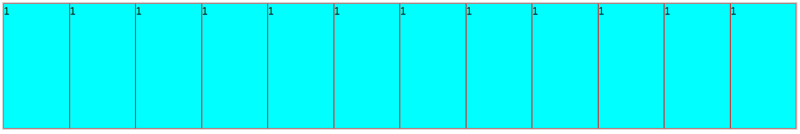

# 父级容器属性

**flex-direction：控制主轴方向**

> row（默认）横向从左至右排列
>
> row-reverse横向从右至左排列
>
> column从上到下排列
>
> column-reverse从下至上排列

**flex-wrap：是否换行**

> nowrap（默认）一行
>
> wrap宽度不够旧换行（从上至下）
>
> wrap-reverse宽度不够旧换行（从下至上）

由于弹性项目flex默认为0 1 auto不放大、可缩小、宽度由内容决定，当父容器不换行宽度不够时，子项目会被压缩，即使设置了宽度width



```css
.container {
    display: flex;
    height: 200px;
    border: 2px solid #ccc;
}

.child {
    width: 200px;
    background-color: aqua;
    border: 1px solid red;
}
```

```htm
<div class="container">
    <div class="child">1</div>
    ...
</div>
```

**justify-content：主轴对齐方式**

flex-start（默认）从头开始排

flex-end从尾开始排

center居中

space-between两端对齐父容器，中间弹性项目之间间隔相等

space-around每个弹性项目左右都有间隔，项目之间的间隔是边缘与父容器间隔的2倍

space-evenly每个弹性项目左右都有间隔，且间隔大小相同

**align-items：副轴对齐方式**

stretch（默认）拉伸填满容器高度

flex-start顶部对齐

flex-end底部对齐

center垂直居中

# 子级容器属性

**flex-grow：放大比例**

默认为0不放大
**flex-shrink：缩小比例**

默认为1等比缩小

**flex-basis：初始大小**

默认auto，根据内容进行自适应

可以设置为xxxpx/xx%

弹性项目实际宽度：flex-basis优先级高于width；当flex-basis不是auto时使用flex-basis作为初始尺寸；当flex-basis为auto时，则宽度跟随width，width为具体值则为具体值，为auto则适应内容尺寸

**flex：上述三个属性的简写**

```css
flex:1 => 1 1 0%;
flex:200 => 1 1 200px;
flex:auto => 1 1 auto;
flex:none => 0 0 auto;
```


